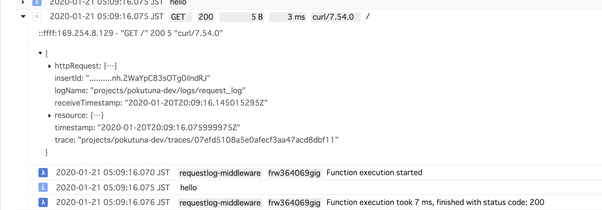

@pokutuna/requestlog-cloudfunctions
===

A middlewrae to write a `httpRequest` log with `trace` fields on Cloud Functions.

This makes it possible to group your application logs in a HTTP request.



## Usage

```ts
import express = require("express");
import { logHttpRequest } from "@pokutuna/requestlog-cloudfunctions";

const projectId = "<YOUR_PROJECT_ID>";
const logId = "request_log";

const app = express();
app.use(logHttpRequesst({ projectId, logId }));
...
```

### Options

- `projectId`
  - default: `process.env.GCLOUD_PROJECT`
  - You must give `projectId` on nodejs10 runtime which doesn't provide `GCLOUD_PROJECT` environment variable.
- `logId`
  - default: `"request_log"`
  - Logs are written to logName `projects/{projectId}/logs/{logId}` on Stackdriver Logging

## Writing logs

- (Recommend) use `@google-cloud/logging-winston` or `@google-cloud/logging-bunyan`
  - see [Setting Up Stackdriver Logging for Node.js  |  Stackdriver Logging  |  Google Cloud](https://cloud.google.com/logging/docs/setup/nodejs)
  - These libraries provide `req.log(...)` method considering the trace field.
- Or write `trace` fields by yourself.
  - The `X-Cloud-Trace-Context` request header contains `${traceId}/${spanId}`
  - Write `trace` field with `projects/${projectId}/traces/${traceId}` in metadata of a entry using the client library `@google-cloud/logging`.
